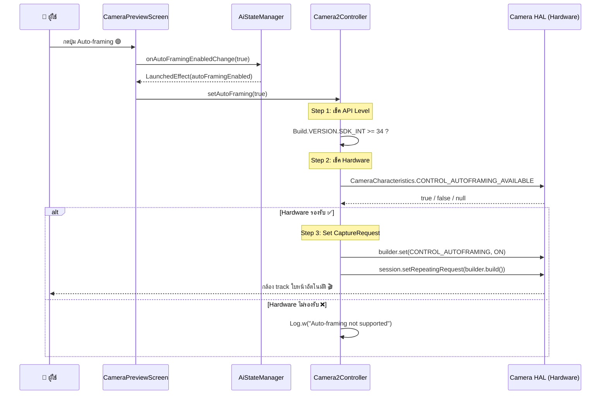

# 🎯 Auto-framing (Center Stage) — สรุปการเรียกใช้และข้อจำกัด

## สรุปภาพรวม

เราได้เพิ่มฟีเจอร์ **Auto-framing** (ที่ Apple เรียกว่า Center Stage) เข้าไปในแอป โดยใช้ Android Camera2 API `CONTROL_AUTOFRAMING` ซึ่งเป็น Native API ที่ Google เปิดให้ใช้ตั้งแต่ **Android 14 (API 34)** เป็นต้นไป

---

## ไฟล์ที่แก้ไข

| ไฟล์ | การเปลี่ยนแปลง |
|---|---|
| [AiStateManager.kt](file:///Users/mr.kritchanat/Desktop/android-control-ocr/app/src/main/java/com/example/android_screen_relay/presenter/AiStateManager.kt) | เพิ่ม `autoFramingEnabled: Boolean = false` ใน `AiState` data class |
| [Camera2Controller.kt](file:///Users/mr.kritchanat/Desktop/android-control-ocr/app/src/main/java/com/example/android_screen_relay/presenter/media/Camera2Controller.kt) | เพิ่ม `setAutoFraming()`, `isAutoFramingSupported()` และ apply ใน session setup |
| [CameraPreviewScreen.kt](file:///Users/mr.kritchanat/Desktop/android-control-ocr/app/src/main/java/com/example/android_screen_relay/view/components/CameraPreviewScreen.kt) | เพิ่มปุ่ม Toggle + `LaunchedEffect` สำหรับ sync state |
| [AIScreen.kt](file:///Users/mr.kritchanat/Desktop/android-control-ocr/app/src/main/java/com/example/android_screen_relay/view/screen/AIScreen.kt) | เพิ่ม `autoFramingEnabled` property ใน wrapper + ส่งผ่าน CameraPreviewScreen |

---

## วิธีเรียกใช้ (API Flow)



---

## โค้ดหลักที่เรียกใช้

### 1. ตรวจสอบว่า Hardware รองรับหรือไม่

```kotlin
// จาก: CameraCharacteristics#CONTROL_AUTOFRAMING_AVAILABLE
// Type: Boolean | null
// Added in API 34

val autoFramingAvailable = characteristics?.get(
    CameraCharacteristics.CONTROL_AUTOFRAMING_AVAILABLE
)
// true  = รองรับ
// false = ไม่รองรับ  
// null  = API key ไม่มีในเครื่องนี้ (Android < 14 หรือ HAL ไม่ implement)
```

### 2. สั่งเปิด/ปิด Auto-framing

```kotlin
// จาก: CaptureRequest#CONTROL_AUTOFRAMING
// Type: Int (0 = OFF, 1 = ON)
// Added in API 34

builder.set(
    CaptureRequest.CONTROL_AUTOFRAMING,
    CaptureRequest.CONTROL_AUTOFRAMING_ON    // ค่า 1 = เปิด
    // CaptureRequest.CONTROL_AUTOFRAMING_OFF  // ค่า 0 = ปิด
)
session.setRepeatingRequest(builder.build(), null, backgroundHandler)
```

### 3. อ่านผลลัพธ์จาก CaptureResult (Optional)

```kotlin
// จาก: CaptureResult#CONTROL_AUTOFRAMING_STATE
// Type: Int
// ค่าที่เป็นไปได้:
//   CONTROL_AUTOFRAMING_STATE_INACTIVE   = 0  (ไม่ active)
//   CONTROL_AUTOFRAMING_STATE_FRAMING    = 1  (กำลัง track/ปรับ frame)
//   CONTROL_AUTOFRAMING_STATE_CONVERGED  = 2  (track เสร็จ ล็อกตำแหน่ง)

// ⚠️ ยังไม่ได้ implement ในโค้ดปัจจุบัน แต่สามารถเพิ่มได้
```

---

## ข้อจำกัดที่พบ

### 🔴 ข้อจำกัดระดับ Critical

| # | ข้อจำกัด | รายละเอียด |
|---|---|---|
| 1 | **ต้อง Android 14 (API 34) ขึ้นไป** | API `CONTROL_AUTOFRAMING` ถูกเพิ่มใน API 34 เท่านั้น เครื่องที่ต่ำกว่านี้ใช้ไม่ได้เลย |
| 2 | **Hardware ต้องรองรับ** | แม้จะเป็น Android 14+ แต่ถ้า OEM ไม่ได้ implement `CONTROL_AUTOFRAMING_AVAILABLE = true` ใน Camera HAL ก็ใช้ไม่ได้ |
| 3 | **OEM ส่วนใหญ่ไม่ expose ผ่าน Camera2 API** | Samsung ฝัง Auto Framing ไว้ใน Video Call Effects (proprietary), Pixel ใช้ผ่าน Google Meet — **ไม่ได้ expose ผ่าน Camera2 API มาตรฐาน** ให้ 3rd-party app ใช้ |

### 🟡 ข้อจำกัดระดับ Warning

| # | ข้อจำกัด | รายละเอียด |
|---|---|---|
| 4 | **ไม่มีรายชื่อเครื่องที่รองรับ** | Google ไม่มี official list — ต้องเช็ค runtime ด้วย `CONTROL_AUTOFRAMING_AVAILABLE` ทุกครั้ง |
| 5 | **ต้องมีกล้องหน้า Ultra-wide** | Auto-framing ทำงานโดยการ crop จาก FOV กว้าง → ถ้ากล้องไม่ใช่ ultra-wide จะไม่มี room ให้ pan/zoom |
| 6 | **อาจ conflict กับ manual zoom** | ตอน auto-framing ทำงาน กล้องจะจัดการ crop/zoom เอง → ค่า `zoomScale` ที่ set ด้วยมืออาจถูก override |
| 7 | **ไม่มี Software Fallback** | ถ้า hardware ไม่รองรับ ปุ่มกดได้แต่ไม่เกิดอะไร — ยังไม่มี ML Kit-based fallback |

### 🔵 ข้อจำกัดระดับ Info

| # | ข้อจำกัด | รายละเอียด |
|---|---|---|
| 8 | **minSdk ของแอป = 24** | ต้องใช้ `@SuppressLint("NewApi")` + runtime check `Build.VERSION.SDK_INT >= 34` |
| 9 | **ยังไม่ได้อ่าน `CONTROL_AUTOFRAMING_STATE`** | สามารถเพิ่ม CaptureCallback เพื่อดูว่า auto-framing กำลัง FRAMING, CONVERGED, หรือ INACTIVE |
| 10 | **Toast feedback เท่านั้น** | ยังไม่มี UI indicator บอกว่า "เครื่องนี้ไม่รองรับ" — แค่ Toast "Auto-framing ON/OFF" |

---

## เครื่องที่ทดสอบ (จากการสอบถาม)

| เครื่อง | Model | Android | ผลลัพธ์ |
|---|---|---|---|
| Huawei P40 Pro | ELS-NX9 | 10 (EMUI) | ❌ OS ต่ำเกินไป + ไม่ใช่ Android มาตรฐาน |
| Samsung Galaxy A56 5G | SM-A566B | 15 | ⚠️ API Level ผ่าน แต่ Hardware ไม่น่ารองรับ (A-series) |
| Infinix GT 20 Pro | X6871 | 14 | ⚠️ API Level ผ่าน แต่ Infinix ไม่มี HAL implementation |
| Samsung Galaxy A22 5G | — | 13 | ❌ OS ต่ำกว่า API 34 |
| Samsung Galaxy A70 | — | 11 | ❌ OS ต่ำกว่า API 34 |

---

## ข้อเสนอแนะสำหรับอนาคต

### ระยะสั้น
1. **เพิ่ม UI feedback** เมื่อ hardware ไม่รองรับ — แสดง dialog หรือ snackbar แจ้งว่า "เครื่องนี้ไม่รองรับ Auto-framing"
2. **อ่าน `CONTROL_AUTOFRAMING_STATE`** จาก CaptureResult เพื่อแสดงสถานะ (Tracking / Converged / Inactive) บน UI
3. **ซ่อนปุ่ม** ถ้าเครื่องไม่รองรับ โดยเช็ค `isAutoFramingSupported()` ตอน composable render

### ระยะยาว
4. **Software-based Fallback** ด้วย ML Kit Face Detection + Digital Crop/Smooth Pan — ทำให้ใช้งานได้บนทุกเครื่อง
5. **รองรับ multi-face tracking** — เมื่อมีหลายคนในเฟรม ให้ zoom out เพื่อให้เห็นทุกคน

---

## Reference Links

- [CameraCharacteristics.CONTROL_AUTOFRAMING_AVAILABLE](https://developer.android.com/reference/android/hardware/camera2/CameraCharacteristics#CONTROL_AUTOFRAMING_AVAILABLE)
- [CaptureRequest.CONTROL_AUTOFRAMING](https://developer.android.com/reference/android/hardware/camera2/CaptureRequest#CONTROL_AUTOFRAMING)
- [CaptureResult.CONTROL_AUTOFRAMING_STATE](https://developer.android.com/reference/android/hardware/camera2/CaptureResult#CONTROL_AUTOFRAMING_STATE)
