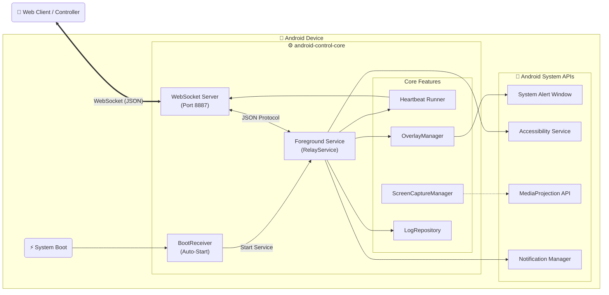

# android-control-ocr

**(Layer 1: Core System / Infrastructure)**

Android system-level control core featuring a persistent background service, overlay process, WebSocket command bus, and structured logging.

---

## 🌟 Key Features

### **WebSocket Communication (JSON-First)**

* **Server Mode**: Runs an internal WebSocket server inside the Android app (Port `8887`) for direct client connections.
* **JSON Protocol**: Uses JSON as the primary communication format between the Android app and the web client—lightweight, readable, and easy to debug.
* **Real-Time Control**: Supports real-time two-way commands from the web client (Ping, Notification, Authentication) with immediate responses.

### **Web Client Interface**

* Includes a ready-to-use web interface (`web_client/index.html`) for testing connections and sending commands.
* **Auto-Reconnect**: Automatically retries connection when disconnected.
* **Live Log Viewer**: View real-time logs and responses from the Android device directly in the browser.

### **Background Operation**

* **Heartbeat System**: Continuously sends status signals to the web client to confirm the app is alive—even when running in the background.
* **Foreground Service**: Ensures long-running execution without being killed by the system.
* **Auto-Start on Boot**: Automatically starts the service when the device boots (via Boot Receiver).

### **Logging & Export**

* **Structured Logs**: Logs include timestamps, components, events, and payload data.
* **JSON Export**: Logs can be exported as JSON files for offline analysis (local time aligned with Thailand timezone).

### **Security**

* **Passkey Authentication**: Requires a valid passkey before accepting any remote command.

### **Internal Log System**

* Centralized logging via `LogRepository` for debugging, auditing, and reliability analysis.

---

## 🛠️ Installation & Usage

### Android App Side

1. **Install the Application**

   * Deploy the project to an Android device (Android 7.0+ supported).

2. **Permissions Setup** ⚠️ *Critical*

   * **Display over other apps** (required for overlay rendering)
   * **Accessibility Service**
     Enable `android-control-core` under *Settings > Accessibility*
   * **Notification Permission**
     Required for testing remote notification commands

3. **Start the System**

   * Launch the app and tap **“Start Service”**
   * Note the **IP Address** and **Passkey** shown on the screen
     Example: `ws://192.168.1.X:8887`

---

### Web Client (Controller Side)

1. **Open Web Interface**

   * Open `web_client/index.html` in any modern browser
     (Chrome, Edge, Safari — must be on the same LAN)

2. **Connect**

   * WebSocket URL: `ws://<ANDROID_IP>:8887`
   * Passkey: Use the value displayed on the Android app
   * Click **Connect**

3. **Send Test Commands**

   * **Ping**: Measure latency
   * **Notification**: Trigger a notification on the Android device (background test)

---

## 🧪 Testing Guide

### Control & Command System (JSON)

1. Start the Android app and launch the service.
2. Connect using the web client.
3. **Heartbeat Check**

   * Observe logs on the web UI.
   * You should see:
     `💓 Heartbeat Status Changed`
4. **Background Test**

   * Press the Home button on the Android device.
   * Heartbeat logs should show:

     ```json
     "is_background": true
     ```
5. **Command Validation**

   * Click **Test Notification** on the web UI.
   * Confirm that a notification appears on the Android device.

✅ Confirms full two-way communication and background execution.

---

## 🏗️ System Diagram (Detailed)



---

## 📝 Engineering Notes

### Objectives (Latest Updates)

* **Stability First**: Focus on connection stability and command reliability before introducing video streaming.
* **True Two-Way Control**: Validate real remote control with confirmed acknowledgements (notifications + logs).
* **High Debuggability**: Improve logging detail and exportability to minimize time-to-resolution.

### Technical Overview

* **Architecture**: MVVM with a service-centric execution model.
* **Networking**:

  * Mobile server: `org.java_websocket` (Port 8887)
  * Web client: Browser WebSocket API
* **Security**: Passkey-based authentication before command execution.
* **Reliability**: Foreground Service + Heartbeat mechanism to maintain persistent connectivity.

---

## ✅ Completed Tasks

* [x] **Project Setup**

  * Android project with MVVM / Compose support
* [x] **Network Core**

  * WebSocket server (`RelayServer`) on port 8887
  * Custom JSON protocol design
* [x] **Web Client**

  * Controller dashboard (`index.html`)
  * Auto-reconnect, authentication, and log viewer
* [x] **Control System**

  * Heartbeat status reporting
  * Remote notification execution
  * Background execution support
* [x] **Logging System**

  * JSON log export (local time)
  * Reliable logging (no data loss)
  * Centralized `LogRepository` for auditing

---

## 🔗 References

* Java-WebSocket Library: [https://github.com/TooTallNate/Java-WebSocket](https://github.com/TooTallNate/Java-WebSocket)
* Android Foreground Services: [https://developer.android.com/guide/components/foreground-services](https://developer.android.com/guide/components/foreground-services)
* Android Accessibility Service: [https://developer.android.com/reference/android/accessibilityservice/AccessibilityService](https://developer.android.com/reference/android/accessibilityservice/AccessibilityService)
* MediaProjection API: [https://developer.android.com/guide/topics/large-screens/media-projection](https://developer.android.com/guide/topics/large-screens/media-projection)
* Reference App: *Let’s View* (background & overlay behavior)

