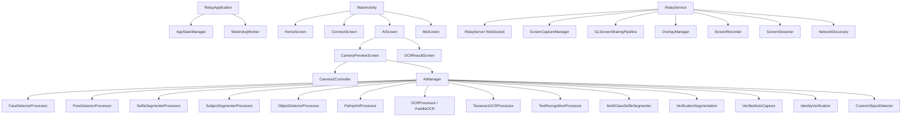

# 🔬 Project Analysis — Feature & Function Mapping

## สถาปัตยกรรมปัจจุบัน



---

## 1. Feature & Function Table

### Layer 1: AI Processors (14 ตัว)

| # | Processor | ไฟล์ | Engine | หน้าที่ | ขนาด |
|---|---|---|---|---|---|
| 1 | `FaceDetectorProcessor` | [FaceDetectorProcessor.kt](file:///Users/mr.kritchanat/Desktop/android-control-ocr/app/src/main/java/com/example/android_screen_relay/presenter/ai/FaceDetectorProcessor.kt) | ML Kit | ตรวจจับใบหน้า, landmarks, contours | 8.8KB |
| 2 | `PoseDetectorProcessor` | [PoseDetectorProcessor.kt](file:///Users/mr.kritchanat/Desktop/android-control-ocr/app/src/main/java/com/example/android_screen_relay/presenter/ai/PoseDetectorProcessor.kt) | ML Kit | ตรวจจับท่าทาง 33 จุด | 3.6KB |
| 3 | `SelfieSegmenterProcessor` | [SelfieSegmenterProcessor.kt](file:///Users/mr.kritchanat/Desktop/android-control-ocr/app/src/main/java/com/example/android_screen_relay/presenter/ai/SelfieSegmenterProcessor.kt) | ML Kit | แยกพื้นหลัง selfie | 4.0KB |
| 4 | `MultiClassSelfieSegmenter` | [MultiClassSelfieSegmenterProcessor.kt](file:///Users/mr.kritchanat/Desktop/android-control-ocr/app/src/main/java/com/example/android_screen_relay/presenter/ai/MultiClassSelfieSegmenterProcessor.kt) | MediaPipe | แยก Face/Hair/Body/Clothes/BG | 11KB |
| 5 | `SubjectSegmenterProcessor` | [SubjectSegmenterProcessor.kt](file:///Users/mr.kritchanat/Desktop/android-control-ocr/app/src/main/java/com/example/android_screen_relay/presenter/ai/SubjectSegmenterProcessor.kt) | ML Kit | แยก subject จาก background | 9.0KB |
| 6 | `ObjectDetectorProcessor` | [ObjectDetectorProcessor.kt](file:///Users/mr.kritchanat/Desktop/android-control-ocr/app/src/main/java/com/example/android_screen_relay/presenter/ai/ObjectDetectorProcessor.kt) | ML Kit | ตรวจจับวัตถุทั่วไป | 2.4KB |
| 7 | `CustomObjectDetectorProcessor` | [CustomObjectDetectorProcessor.kt](file:///Users/mr.kritchanat/Desktop/android-control-ocr/app/src/main/java/com/example/android_screen_relay/presenter/ai/CustomObjectDetectorProcessor.kt) | ML Kit | ตรวจจับวัตถุ custom model | 3.0KB |
| 8 | `TextRecognitionProcessor` | [TextRecognitionProcessor.kt](file:///Users/mr.kritchanat/Desktop/android-control-ocr/app/src/main/java/com/example/android_screen_relay/presenter/ai/TextRecognitionProcessor.kt) | ML Kit | อ่านข้อความ Latin+Thai | 2.5KB |
| 9 | `PalmprintProcessor` | [PalmprintProcessor.kt](file:///Users/mr.kritchanat/Desktop/android-control-ocr/app/src/main/java/com/example/android_screen_relay/presenter/ai/PalmprintProcessor.kt) | MediaPipe | ตรวจจับลายฝ่ามือ + landmarks | 13KB |
| 10 | `OCRProcessor` | [OCRProcessor.kt](file:///Users/mr.kritchanat/Desktop/android-control-ocr/app/src/main/java/com/example/android_screen_relay/presenter/ocr/OCRProcessor.kt) | PaddleOCR | OCR ภาษาไทย+อังกฤษ | 3.9KB |
| 11 | `TesseractOCRProcessor` | [TesseractOCRProcessor.kt](file:///Users/mr.kritchanat/Desktop/android-control-ocr/app/src/main/java/com/example/android_screen_relay/presenter/ocr/TesseractOCRProcessor.kt) | Tesseract | OCR แบบ fast scan | 4.7KB |
| 12 | `VerificationSegmentation` | [VerificationSegmentationProcessor.kt](file:///Users/mr.kritchanat/Desktop/android-control-ocr/app/src/main/java/com/example/android_screen_relay/presenter/ai/VerificationSegmentationProcessor.kt) | MediaPipe+ML Kit | ตัดพื้นหลัง+ลบมือ สำหรับ verify | 30KB |
| 13 | `VerifiedAutoCaptureProcessor` | [VerifiedAutoCaptureProcessor.kt](file:///Users/mr.kritchanat/Desktop/android-control-ocr/app/src/main/java/com/example/android_screen_relay/presenter/ai/VerifiedAutoCaptureProcessor.kt) | ML Kit | ถ่ายอัตโนมัติเมื่อ face ตรงเงื่อนไข | 9.4KB |
| 14 | `IdentityVerificationProcessor` | [IdentityVerificationProcessor.kt](file:///Users/mr.kritchanat/Desktop/android-control-ocr/app/src/main/java/com/example/android_screen_relay/presenter/ai/IdentityVerificationProcessor.kt) | ML Kit | ตรวจสอบตัวตน face matching | 2.7KB |

### Layer 2: Camera & Media

| # | Component | ไฟล์ | หน้าที่ | ขนาด |
|---|---|---|---|---|
| 1 | `Camera2Controller` | [Camera2Controller.kt](file:///Users/mr.kritchanat/Desktop/android-control-ocr/app/src/main/java/com/example/android_screen_relay/presenter/media/Camera2Controller.kt) | จัดการกล้อง Camera2 API, zoom, flash, auto-framing, resolution | 44KB |
| 2 | `FrameProcessingRunnable` | [FrameProcessingRunnable.kt](file:///Users/mr.kritchanat/Desktop/android-control-ocr/app/src/main/java/com/example/android_screen_relay/presenter/media/FrameProcessingRunnable.kt) | Thread สำหรับ process frame | 2.5KB |
| 3 | `ScreenCaptureManager` | [ScreenCaptureManager.kt](file:///Users/mr.kritchanat/Desktop/android-control-ocr/app/src/main/java/com/example/android_screen_relay/presenter/media/ScreenCaptureManager.kt) | จับหน้าจอ MediaProjection | 9.8KB |

### Layer 3: Networking & Streaming

| # | Component | ไฟล์ | หน้าที่ | ขนาด |
|---|---|---|---|---|
| 1 | `RelayServer` | [RelayServer.kt](file:///Users/mr.kritchanat/Desktop/android-control-ocr/app/src/main/java/com/example/android_screen_relay/service/RelayServer.kt) | WebSocket server, auth, command routing | 20KB |
| 2 | `NetworkDiscovery` | [NetworkDiscovery.kt](file:///Users/mr.kritchanat/Desktop/android-control-ocr/app/src/main/java/com/example/android_screen_relay/presenter/network/NetworkDiscovery.kt) | UDP broadcast discovery + passkey | 9.1KB |
| 3 | `WebSocketManager` | [WebSocketManager.kt](file:///Users/mr.kritchanat/Desktop/android-control-ocr/app/src/main/java/com/example/android_screen_relay/presenter/network/WebSocketManager.kt) | WebSocket client wrapper | 2.2KB |
| 4 | `ScreenStreamer` | [ScreenStreamer.kt](file:///Users/mr.kritchanat/Desktop/android-control-ocr/app/src/main/java/com/example/android_screen_relay/presenter/streaming/ScreenStreamer.kt) | Stream frames ไป WebSocket clients | 1.2KB |
| 5 | `ScreenRecorder` | [ScreenRecorder.kt](file:///Users/mr.kritchanat/Desktop/android-control-ocr/app/src/main/java/com/example/android_screen_relay/presenter/recording/ScreenRecorder.kt) | บันทึกวิดีโอหน้าจอ | 5.3KB |
| 6 | `GLScreenSharingPipeline` | [GLScreenSharingPipeline.kt](file:///Users/mr.kritchanat/Desktop/android-control-ocr/app/src/main/java/com/example/android_screen_relay/opengl/GLScreenSharingPipeline.kt) | OpenGL pipeline stream+record พร้อมกัน | 8.9KB |

### Layer 4: System & Monitoring

| # | Component | ไฟล์ | หน้าที่ | ขนาด |
|---|---|---|---|---|
| 1 | `SystemMonitor` | [SystemMonitor.kt](file:///Users/mr.kritchanat/Desktop/android-control-ocr/app/src/main/java/com/example/android_screen_relay/presenter/system/SystemMonitor.kt) | RAM/CPU/Battery/Device info | 10KB |
| 2 | `ResourceWatchdog` | [ResourceWatchdog.kt](file:///Users/mr.kritchanat/Desktop/android-control-ocr/app/src/main/java/com/example/android_screen_relay/presenter/system/ResourceWatchdog.kt) | เฝ้าระวัง memory leak + heartbeat | 8.6KB |
| 3 | `FirebaseLogger` | [FirebaseLogger.kt](file:///Users/mr.kritchanat/Desktop/android-control-ocr/app/src/main/java/com/example/android_screen_relay/presenter/system/FirebaseLogger.kt) | Logging → Firestore + Google Sheets | 11KB |
| 4 | `OverlayManager` | [OverlayManager.kt](file:///Users/mr.kritchanat/Desktop/android-control-ocr/app/src/main/java/com/example/android_screen_relay/presenter/system/OverlayManager.kt) | Floating overlay แสดง metrics | 6.6KB |
| 5 | `IDCardFaceBenchmarker` | [IDCardFaceBenchmarker.kt](file:///Users/mr.kritchanat/Desktop/android-control-ocr/app/src/main/java/com/example/android_screen_relay/presenter/system/IDCardFaceBenchmarker.kt) | Benchmark face vs ID card | 4.9KB |

### Layer 5: State Management

| # | Component | ไฟล์ | หน้าที่ | ขนาด |
|---|---|---|---|---|
| 1 | `AiStateManager` | [AiStateManager.kt](file:///Users/mr.kritchanat/Desktop/android-control-ocr/app/src/main/java/com/example/android_screen_relay/presenter/AiStateManager.kt) | StateFlow สำหรับ AI/Camera settings | 2.3KB |
| 2 | `AppStateManager` | [AppStateManager.kt](file:///Users/mr.kritchanat/Desktop/android-control-ocr/app/src/main/java/com/example/android_screen_relay/model/AppStateManager.kt) | App lifecycle (FG/BG/Screen) | 2.5KB |
| 3 | `ComputeModeManager` | [ComputeMode.kt](file:///Users/mr.kritchanat/Desktop/android-control-ocr/app/src/main/java/com/example/android_screen_relay/model/ComputeMode.kt) | CPU/GPU mode selection | 0.9KB |
| 4 | `AIManager` | [AIManager.kt](file:///Users/mr.kritchanat/Desktop/android-control-ocr/app/src/main/java/com/example/android_screen_relay/presenter/ai/AIManager.kt) | Processor switching + process pipeline | 15KB |

### Layer 6: UI Components

| # | Component | ไฟล์ | หน้าที่ | ขนาด |
|---|---|---|---|---|
| 1 | `AIScreen` | [AIScreen.kt](file:///Users/mr.kritchanat/Desktop/android-control-ocr/app/src/main/java/com/example/android_screen_relay/view/screen/AIScreen.kt) | หน้าจอหลัก AI + state hoisting | **105KB** ⚠️ |
| 2 | `CameraPreviewScreen` | [CameraPreviewScreen.kt](file:///Users/mr.kritchanat/Desktop/android-control-ocr/app/src/main/java/com/example/android_screen_relay/view/components/CameraPreviewScreen.kt) | Preview + controls + overlays | **97KB** ⚠️ |
| 3 | `OCRResultScreen` | [OCRResultScreen.kt](file:///Users/mr.kritchanat/Desktop/android-control-ocr/app/src/main/java/com/example/android_screen_relay/view/components/OCRResultScreen.kt) | แสดงผล OCR + export | 54KB |
| 4 | `AiModeSelector` | [AiModeSelector.kt](file:///Users/mr.kritchanat/Desktop/android-control-ocr/app/src/main/java/com/example/android_screen_relay/view/components/AiModeSelector.kt) | Bottom sheet เลือก AI mode | 8.7KB |
| 5 | `FaceResultComponents` | [FaceResultComponents.kt](file:///Users/mr.kritchanat/Desktop/android-control-ocr/app/src/main/java/com/example/android_screen_relay/view/components/FaceResultComponents.kt) | UI แสดงผล face detection | 11KB |
| 6 | `ReportComponents` | [ReportComponents.kt](file:///Users/mr.kritchanat/Desktop/android-control-ocr/app/src/main/java/com/example/android_screen_relay/view/components/ReportComponents.kt) | UI แสดง report/stats | 8.0KB |

### Layer 7: Services & Lifecycle

| # | Component | ไฟล์ | หน้าที่ | ขนาด |
|---|---|---|---|---|
| 1 | `RelayService` | [RelayService.kt](file:///Users/mr.kritchanat/Desktop/android-control-ocr/app/src/main/java/com/example/android_screen_relay/service/RelayService.kt) | Foreground service หลัก | 25KB |
| 2 | `RelayApplication` | [RelayApplication.kt](file:///Users/mr.kritchanat/Desktop/android-control-ocr/app/src/main/java/com/example/android_screen_relay/RelayApplication.kt) | App entry, crash handler, watchdog | 9.5KB |
| 3 | `WatchdogWorker` | [WatchdogWorker.kt](file:///Users/mr.kritchanat/Desktop/android-control-ocr/app/src/main/java/com/example/android_screen_relay/service/WatchdogWorker.kt) | WorkManager watchdog | 1.9KB |
| 4 | `BootReceiver` | [BootReceiver.kt](file:///Users/mr.kritchanat/Desktop/android-control-ocr/app/src/main/java/com/example/android_screen_relay/service/BootReceiver.kt) | Auto-start on boot | 0.9KB |

---

## 2. ปัญหาที่พบ (Pain Points)

| # | ปัญหา | ไฟล์ที่เกี่ยว | ระดับ |
|---|---|---|---|
| 1 | **AIScreen.kt ใหญ่เกินไป (105KB)** — รวม state, logic, UI ไว้ในไฟล์เดียว | AIScreen.kt | 🔴 Critical |
| 2 | **CameraPreviewScreen.kt ใหญ่เกินไป (97KB)** — controls, overlay, preview ทั้งหมด | CameraPreviewScreen.kt | 🔴 Critical |
| 3 | **AIManager ใช้ string matching** — `modeName.contains("FACE")` แทนที่จะใช้ type-safe enum | AIManager.kt | 🟡 Warning |
| 4 | **AiState data class ใหญ่เกินไป** — 40+ fields ผสม camera, AI, UI, perf ไว้ด้วยกัน | AiStateManager.kt | 🟡 Warning |
| 5 | **Tight coupling** — Camera2Controller ถูกเรียกตรงจาก Composable ผ่าน `LaunchedEffect` | CameraPreviewScreen.kt | 🟡 Warning |
| 6 | **ไม่มี DI** — ใช้ `object` singleton ทั้ง AIManager, AiStateManager, SystemMonitor | ทั้งโปรเจค | 🔵 Info |

---

## 3. แนะนำวิธีแยก Module — Strategy Pattern + Plugin Registry

### หลักการ: **"Wrap แล้วค่อย Replace"**

> ❌ **อย่าทำ:** Refactor ยกเครื่องทั้งหมดทีเดียว → กระทบทุกไฟล์ เสี่ยง crash
>
> ✅ **ให้ทำ:** สร้าง Abstraction Layer คร่อมโค้ดเก่า → ค่อยๆ ย้ายทีละ module

### Phase 1: สร้าง Feature Registry (ไม่กระทบโค้ดเก่าเลย)

```kotlin
// ไฟล์ใหม่: core/feature/FeatureRegistry.kt
interface Feature {
    val id: String
    val displayName: String
    val icon: ImageVector
    val category: FeatureCategory
    val requiredApiLevel: Int  // e.g. 34 for auto-framing
    
    fun isSupported(context: Context): Boolean
    fun onEnable(context: Context)
    fun onDisable(context: Context)
}

enum class FeatureCategory {
    AI_DETECTION,      // Face, Pose, Object
    AI_SEGMENTATION,   // Selfie, Subject, Multi-class
    AI_OCR,            // PaddleOCR, Tesseract, ML Kit Text
    AI_VERIFICATION,   // Identity, VerifiedAutoCapture
    CAMERA_CONTROL,    // Zoom, Flash, Auto-framing, Flip
    STREAMING,         // Screen share, Recording
    SYSTEM             // Watchdog, Overlay, Logging
}

object FeatureRegistry {
    private val features = mutableMapOf<String, Feature>()
    
    fun register(feature: Feature) { features[feature.id] = feature }
    fun getByCategory(cat: FeatureCategory) = features.values.filter { it.category == cat }
    fun isEnabled(id: String) = features[id]?.let { /* check state */ } ?: false
}
```

### Phase 2: Wrap existing processors (ไม่แก้โค้ดเก่า)

```kotlin
// ไฟล์ใหม่: core/feature/FaceDetectionFeature.kt
class FaceDetectionFeature : Feature {
    override val id = "face_detection"
    override val displayName = "Face Detection"
    override val icon = Icons.Filled.Face
    override val category = FeatureCategory.AI_DETECTION
    override val requiredApiLevel = 24
    
    // ใช้ processor เก่าเดิมเลย ไม่ต้องแก้
    override fun onEnable(context: Context) {
        AIManager.switchProcessor(context, "FACE")
    }
    override fun onDisable(context: Context) {
        AIManager.release()
    }
    override fun isSupported(context: Context) = true
}
```

### Phase 3: แยก AiState ออกเป็น sub-states

```kotlin
// แทนที่จะมี AiState ตัวเดียว 40+ fields
// แยกเป็น:
data class CameraState(
    val zoomScale: Float = 1.0f,
    val isFrontCamera: Boolean = false,
    val autoFramingEnabled: Boolean = false,
    val horizontalFlip: Boolean = false,
    val verticalFlip: Boolean = false,
    val selectedResolution: Size? = null,
    val selectedCameraId: String = "0",
    val selectedAspectRatio: UiAspectRatio = UiAspectRatio.RATIO_1_1
)

data class AiProcessingState(
    val currentAiMode: AiMode = AiMode.PREVIEW,
    val isProcessing: Boolean = false,
    val computeMode: ComputeMode = ComputeMode.GPU,
    val currentImage: Bitmap? = null,
    val cropImage: Bitmap? = null,
    val processingResultMsg: String? = null
)

data class PerformanceState(
    val fps: Int = 0,
    val detectorLatency: Long = 0L,
    val ramUsed: Long = 0L,
    val ramTotal: Long = 0L,
    val cpuUsage: String = "0.0%"
)

// AiState คงไว้เป็น aggregate แต่ delegate ลง sub-states
data class AiState(
    val camera: CameraState = CameraState(),
    val ai: AiProcessingState = AiProcessingState(),
    val performance: PerformanceState = PerformanceState(),
    // ... ย้ายทีละกลุ่ม
)
```

### สรุป Roadmap

| Phase | ทำอะไร | กระทบโค้ดเก่า | ระยะเวลา |
|---|---|---|---|
| **Phase 1** | สร้าง `FeatureRegistry` + `Feature` interface | ❌ ไม่กระทบ | 1 วัน |
| **Phase 2** | สร้าง Feature wrapper ครอบ processor เก่า | ❌ ไม่กระทบ | 2-3 วัน |
| **Phase 3** | แยก `AiState` → sub-states (ทีละกลุ่ม) | ⚠️ กระทบบางส่วน | 2-3 วัน |
| **Phase 4** | แยก `AIScreen.kt` 105KB → components | ⚠️ กระทบ UI layer | 3-5 วัน |
| **Phase 5** | แยก `CameraPreviewScreen.kt` 97KB → components | ⚠️ กระทบ UI layer | 3-5 วัน |
| **Phase 6** | เปลี่ยน `AIManager` ให้ใช้ enum แทน string matching | ⚠️ กระทบ switching logic | 1 วัน |

> [!IMPORTANT]
> **Phase 1-2 ทำได้ทันทีโดยไม่กระทบโค้ดเก่าเลย** เพราะเป็นการ "เพิ่ม" abstraction layer ใหม่ครอบทับ
> Phase 3-6 ต้องทำทีละ step ค่อยๆ migrate

ต้องการให้เริ่มทำ Phase ไหนก่อนครับ?
