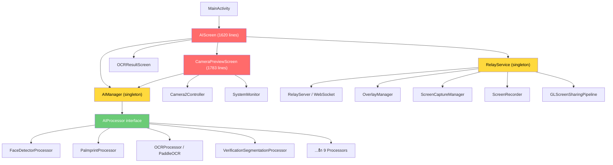

# 🔬 Project Analysis: android-control-ocr

## สรุปภาพรวม (Executive Summary)

โปรเจคนี้เป็น **Android AI Pipeline App** ที่รวมฟีเจอร์ AI หลายตัวไว้ในแอปเดียว — ตั้งแต่ OCR, Face Detection, Segmentation ไปจนถึง Screen Relay/Streaming ปัจจุบันมี **Feature Registry pattern** เริ่มวางไว้แล้ว แต่ **ยังไม่ถูกใช้งานจริง** — โค้ดหลักยังคงเรียก `AIManager` ตรงๆ และ UI ยัง hardcode logic ตาม `AiMode` enum

> [!IMPORTANT]
> **สถานะปัจจุบัน: แยกได้ ~30%** — มี abstraction layer (Feature interface + Registry) พร้อมแล้ว แต่ **ยังไม่ได้ wire เข้ากับ UI/Service จริง** ทำให้ยังสลับ/ปรับ/ถอดฟีเจอร์ไม่ได้จริงในทางปฏิบัติ

---

## 1. ตารางฟีเจอร์ทั้งหมด (Feature Inventory)

### 🤖 AI Detection Features (5)

| # | Feature ID | Display Name | Processor Class | แยกแล้ว? | หมายเหตุ |
|---|-----------|-------------|----------------|----------|---------|
| 1 | `face_detection` | Face Detection | `FaceDetectorProcessor` | ⚠️ บางส่วน | Feature wrapper มีแล้ว แต่ UI hardcode rules (center/size/angle) ใน AIScreen L512-554 |
| 2 | `pose_detection` | Pose Detection | `PoseDetectorProcessor` | ⚠️ บางส่วน | Feature wrapper มี, แต่ preview-only logic hardcode ใน CameraPreviewScreen |
| 3 | `object_detection` | Object Detection | `ObjectDetectorProcessor` | ⚠️ บางส่วน | Feature wrapper มี, UI hardcode preview-only mode |
| 4 | `custom_object_detection` | Custom Object Detection | `CustomObjectDetectorProcessor` | ⚠️ บางส่วน | เหมือน object_detection |
| 5 | `hand_detection` | Palmprint / Hand Detection | `PalmprintProcessor` | ⚠️ บางส่วน | Feature wrapper มี แต่ custom scaling/crop logic hardcode ใน AIScreen L402-431 |

### 🎭 AI Segmentation Features (4)

| # | Feature ID | Display Name | Processor Class | แยกแล้ว? | หมายเหตุ |
|---|-----------|-------------|----------------|----------|---------|
| 6 | `selfie_segmentation` | Selfie Segmentation | `SelfieSegmenterProcessor` | ⚠️ บางส่วน | Feature wrapper มี, mask rendering hardcode ใน CameraPreviewScreen |
| 7 | `multi_class_selfie` | Multi-Class Selfie | `MultiClassSelfieSegmenterProcessor` | ⚠️ บางส่วน | อิงกับ selfieOutputType/selfieSelectClass ที่ pass จาก UI ตรงๆ |
| 8 | `subject_segmentation` | Subject Segmentation | `SubjectSegmenterProcessor` | ⚠️ บางส่วน | Feature wrapper มี, detection rules hardcode ใน AIScreen L556-607 |
| 9 | `verification_segmentation` | Verification Segmentation | `VerificationSegmentationProcessor` | ⚠️ บางส่วน | Processor ใหญ่มาก (29KB), รวม hand masking logic ไว้ในตัว |

### 📝 AI OCR Features (3)

| # | Feature ID | Display Name | Processor Class | แยกแล้ว? | หมายเหตุ |
|---|-----------|-------------|----------------|----------|---------|
| 10 | `paddle_ocr` | PaddleOCR (Thai+EN) | `OCRProcessor` → `PaddleOCR` | ⚠️ บางส่วน | Feature wrapper มี แต่ ID card validation logic hardcode ใน AIScreen L433-480 |
| 11 | `tesseract_ocr` | Tesseract Fast OCR | `TesseractOCRProcessor` | ⚠️ บางส่วน | แชร์ ID card logic เดียวกับ PaddleOCR |
| 12 | `text_recognition` | ML Kit Text Recognition | `TextRecognitionProcessor` | ⚠️ บางส่วน | Feature wrapper มี, มี dedicated handling ใน AIScreen L482-505 |

### ✅ AI Verification Features (2)

| # | Feature ID | Display Name | Processor Class | แยกแล้ว? | หมายเหตุ |
|---|-----------|-------------|----------------|----------|---------|
| 13 | `identity_verification` | Identity Verification | `IdentityVerificationProcessor` | ⚠️ บางส่วน | Feature wrapper มี แต่ pipeline logic ผูกกับ OCR + face ใน AIScreen |
| 14 | `verified_auto_capture` | Verified Auto Capture | `VerifiedAutoCaptureProcessor` | ⚠️ บางส่วน | State-machine processor, handling hardcode ใน AIScreen L609-637 |

### 📷 Camera Control Features (4)

| # | Feature ID | Display Name | แยกแล้ว? | หมายเหตุ |
|---|-----------|-------------|----------|---------|
| 15 | `auto_framing` | Auto-Framing (Center Stage) | ❌ Stub | `onEnable` แค่ log, logic จริงอยู่ใน Camera2Controller |
| 16 | `flash` | Flash / Torch | ❌ Stub | `onEnable` แค่ log |
| 17 | `horizontal_flip` | Horizontal Flip | ❌ Stub | Logic อยู่ใน CameraPreviewScreen โดยตรง |
| 18 | `vertical_flip` | Vertical Flip | ❌ Stub | เหมือน horizontal_flip |

### 🌐 Non-AI Features (ไม่มี Feature wrapper)

| # | ฟีเจอร์ | ไฟล์หลัก | แยกแล้ว? |
|---|---------|---------|----------|
| 19 | Screen Streaming (WebSocket) | `ScreenStreamer`, `RelayServer` | ❌ ผูกกับ RelayService |
| 20 | Screen Recording | `ScreenRecorder` | ❌ ผูกกับ RelayService |
| 21 | Screen Capture | `ScreenCaptureManager` | ❌ ผูกกับ RelayService |
| 22 | OpenGL Pipeline | `GLScreenSharingPipeline` | ❌ ผูกกับ RelayService |
| 23 | Floating Overlay | `OverlayManager` | ❌ ผูกกับ RelayService |
| 24 | System Monitor | `SystemMonitor`, `ResourceWatchdog` | ❌ Singleton |
| 25 | Firebase Logging | `FirebaseLogger` | ❌ Singleton, เรียกจากทุกที่ |
| 26 | Network Discovery | `NetworkDiscovery` | ✅ ค่อนข้างแยกดี |
| 27 | Watchdog Worker | `WatchdogWorker` | ✅ แยกดี (WorkManager) |

---

## 2. ตาราง Function หลักแต่ละ Layer

### Layer: Presenter / AI

| Function | อยู่ไฟล์ | ผูกกับอะไร |
|----------|---------|-----------|
| `AIManager.switchProcessor(mode)` | AIManager.kt | ทุก Processor (hardcode `when` block) |
| `AIManager.process(bitmap)` | AIManager.kt | Active processor + ResourceWatchdog |
| `AIManager.runWithProcessor {}` | AIManager.kt | Thread-safe wrapper |
| `AIManager.release()` | AIManager.kt | RelayService.onDestroy + heartbeat |

### Layer: Presenter / Media

| Function | อยู่ไฟล์ | ผูกกับอะไร |
|----------|---------|-----------|
| `Camera2Controller.openCamera()` | Camera2Controller.kt | CameraPreviewScreen (UI) |
| `ScreenCaptureManager.startCapture()` | ScreenCaptureManager.kt | RelayService |
| `FrameProcessingRunnable` | FrameProcessingRunnable.kt | Camera pipeline |

### Layer: View / Screen

| Function | อยู่ไฟล์ | ขนาด | ปัญหา |
|----------|---------|------|-------|
| `AIScreen()` | AIScreen.kt | **1,620 บรรทัด** | God Composable — รวมทุก AI mode logic |
| `CameraPreviewScreen()` | CameraPreviewScreen.kt | **1,783 บรรทัด** | God Composable — รวม preview + detection + overlay |
| `OCRResultScreen()` | OCRResultScreen.kt | **53KB** | รวม result display ทุก mode |

---

## 3. Coupling Heatmap (ระดับความผูกมัด)

```
🔴 = Tight coupling (ผูกแน่น, แก้ยาก)
🟡 = Moderate coupling (มี abstraction แต่ยังไม่สมบูรณ์)
🟢 = Loose coupling (แยกดี, สลับได้)
```

| Component A | Component B | Level | รายละเอียด |
|-------------|-------------|-------|-----------|
| AIScreen.kt | AiMode enum | 🔴 | `when(mode)` + `if(mode ==)` กระจายทั่วไฟล์ (~15 จุด) |
| AIScreen.kt | AIManager | 🔴 | เรียก `switchProcessor`, `process`, `runWithProcessor` ตรงๆ |
| AIScreen.kt | RelayService | 🔴 | `RelayService.getInstance()` เรียกตรงจาก Composable |
| CameraPreviewScreen | AiMode enum | 🔴 | hardcode crop/frame/blur logic ตาม mode |
| CameraPreviewScreen | Camera2Controller | 🟡 | สร้างใน Composable แต่ logic ค่อนข้างแยก |
| Feature wrappers | AIManager | 🟡 | Delegate ผ่าน `switchProcessor` แต่ไม่มีใครเรียก Feature |
| FeatureRegistry | Feature wrappers | 🟢 | Registry pattern ดี, register/enable/disable พร้อม |
| RelayService | ScreenStreamer/Recorder | 🟡 | อยู่ใน onStartCommand ตรงๆ |
| Processors (แต่ละตัว) | AIProcessor interface | 🟢 | ทุก Processor implement interface เดียวกัน |

---

## 4. Dependency Diagram



> [!WARNING]
> **ปัญหาหลัก**: `AIScreen.kt` (1620 บรรทัด) และ `CameraPreviewScreen.kt` (1783 บรรทัด) เป็น **God Composables** ที่รวม business logic ของทุก AI mode ไว้ในตัว — ทำให้ไม่สามารถสลับ/ปรับฟีเจอร์ได้โดยไม่แก้ไฟล์เหล่านี้

---

## 5. สิ่งที่แยกได้แล้ว vs ยังไม่แยก

### ✅ แยกได้แล้ว (ใช้งานได้จริง)

| ส่วน | รายละเอียด |
|------|-----------|
| `AIProcessor` interface | ทุก Processor มี `init/process/release` เป็น contract เดียวกัน |
| `AIManager.switchProcessor(AiMode)` | สลับ Processor ได้ type-safe ผ่าน enum |
| `Feature` interface + `FeatureRegistry` | Abstraction layer พร้อมแล้ว (register/enable/disable/query) |
| `FeatureInitializer` | ลงทะเบียนทุก feature wrapper ตอน app start |
| `SubStates` | แบ่ง AiState เป็น sub-groups (Camera, AI, Performance, OCR, Watchdog) |
| `AiStateManager` | Centralized state ผ่าน StateFlow |

### ❌ ยังไม่แยก (ปัญหาหลัก)

| ปัญหา | ตำแหน่ง | ผลกระทบ |
|-------|---------|---------|
| **Detection Rules hardcode ใน UI** | AIScreen L402-701 | เพิ่ม/แก้ rule ต้องแก้ UI |
| **Crop/Frame logic ผูก AiMode** | CameraPreviewScreen L370-398, 769-800 | เพิ่ม mode ใหม่ต้องแก้ `when` block |
| **Feature wrappers ไม่ถูกใช้** | FeatureRegistry ลงทะเบียนแล้วแต่ไม่มีใครเรียก | เป็นแค่ dead code |
| **Camera Features เป็น stub** | CameraFeatures.kt | `onEnable` แค่ log ไม่ทำอะไร |
| **Streaming/Recording ผูก Service** | RelayService.kt L210-258 | แยกเปิด/ปิดลำบาก |
| **`AiMode` enum อยู่ผิดที่** | AiMode.kt อยู่ใน `view/components` แต่ package เป็น `core` | สร้างความสับสน |
| **Wildcard imports ซ้ำทุกไฟล์** | AiMode.kt, AiModeSelector.kt, CameraPreviewScreen.kt | ทุกไฟล์ import เหมือนกันหมด ~90 บรรทัด |

---

## 6. สรุป: พร้อมแยกหรือยัง?

| เกณฑ์ | สถานะ | คะแนน |
|-------|-------|-------|
| Processor level (AI Engine) | ✅ แยกดีมาก ผ่าน `AIProcessor` interface | 9/10 |
| Feature abstraction (Registry) | 🟡 มี infrastructure แต่ไม่ถูกใช้ | 4/10 |
| UI ↔ Business Logic | 🔴 ผูกแน่น, God Composables | 2/10 |
| State Management | 🟡 มี AiStateManager แต่ state ใหญ่เกิน | 5/10 |
| Non-AI features (Stream/Record) | 🔴 ผูกกับ RelayService | 2/10 |
| **ภาพรวม** | **⚠️ ยังไม่พร้อมสลับ/ปรับได้จริง** | **~30%** |

---

## 7. Roadmap แนะนำ (ลำดับความสำคัญ)

> [!TIP]
> แนะนำทำตามลำดับนี้ เพื่อลด risk และ ไม่ต้อง rewrite ทั้งหมด

### Phase 1: แยก Detection Rules ออกจาก UI (สำคัญที่สุด)
- สร้าง `DetectionRuleProvider` interface ให้แต่ละ Processor มี `evaluateFrame()` ของตัวเอง
- ย้าย if/when block ออกจาก `AIScreen.onStableDetection` lambda
- **ผลลัพธ์**: เพิ่ม AI mode ใหม่ไม่ต้องแก้ UI

### Phase 2: Wire FeatureRegistry เข้ากับ UI จริง
- ให้ `AiModeSelector` ดึงรายการจาก `FeatureRegistry.getByCategory()` แทน hardcode `AiMode.values()`
- ให้ Feature wrappers เรียก Camera2Controller จริงๆ (ไม่ใช่แค่ log)
- **ผลลัพธ์**: เพิ่ม/ลบ feature จาก `FeatureInitializer` อย่างเดียวพอ

### Phase 3: แตก God Composables
- แยก `AIScreen.kt` (1620 lines) → `AiCaptureHandler` + `AiResultHandler` + `AiScreen` (UI shell)
- แยก `CameraPreviewScreen.kt` (1783 lines) → `CameraPreview` + `OverlayRenderer` + `AutoSnapController`
- **ผลลัพธ์**: แต่ละไฟล์ < 500 บรรทัด, ทดสอบแยกได้

### Phase 4: แยก Non-AI features
- Extract `StreamingFeature`, `RecordingFeature`, `OverlayFeature` จาก RelayService
- ลงทะเบียนเข้า FeatureRegistry ด้วย
- **ผลลัพธ์**: เปิด/ปิด streaming, recording ได้อิสระ

---

> [!CAUTION]
> **ห้ามทำ Big Rewrite** — โปรเจคนี้มี production logic ซับซ้อน (memory management, hand masking, spatial filtering) ที่เขียนมาอย่างละเอียด ควร refactor ทีละ phase ไม่ใช่เขียนใหม่ทั้งหมด
